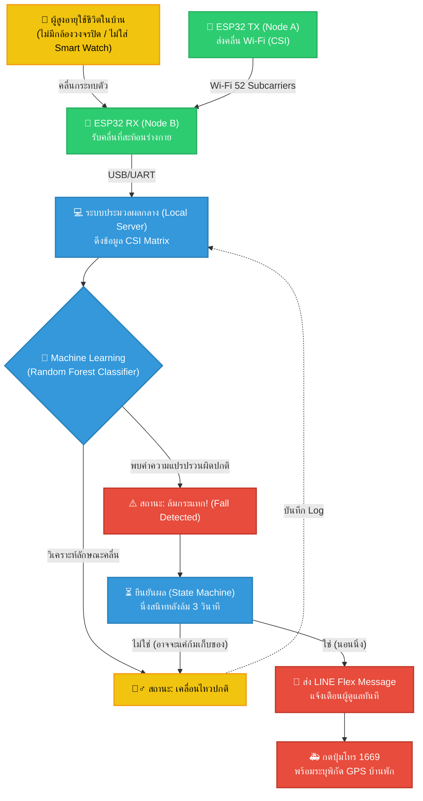

# รายละเอียดการพัฒนา (Development Details) - Sentry

*ตามที่อาจารย์แนะนำ: Flowchart นี้ออกแบบมาให้ "ดูปุ๊บเข้าใจปั๊บ" (หน้าเป็นแบบนี้ -> ใช้งานแบบนี้)*

## 1. System Flowchart (รูปแบบการใช้งานจริง)

## 2. การปรับปรุงตาม Feedback ของอาจารย์

เพื่อให้เอกสารและวีดีโอ Demo พรุ่งนี้สมบูรณ์แบบที่สุด กรุณาปรับเปลี่ยนคำพูดและเนื้อหาดังนี้:

1. **เปลี่ยนคำว่า "AI" เป็นคำที่เฉพาะเจาะจงทางวิชาการ** 
   - ❌ "เราใช้ AI ตรวจจับการล้ม"
   - ✅ "ระบบใช้ **Machine Learning (Random Forest Classifier)** ร่วมกับ **Hybrid Sequence State Machine**"
2. **ย้ำกลุ่มเป้าหมาย (Focus)**
   - ในคลิป Demo พรุ่งนี้ ให้พูดชัดเจนว่า *"ระบบนี้ออกแบบมาสำหรับ ผู้สูงอายุ ที่พักอาศัยตามลำพังในบ้าน หรือ บ้านพักคนชรา (Residential Area) เพื่อแก้ปัญหาเรื่องความเป็นส่วนตัว (Privacy) โดยไม่ต้องพึ่งพากล้องวงจรปิด"*
3. **การเพิ่ม References (อ้างอิง)**
   - ให้หารายชื่องานวิจัยเกี่ยวกับ "Wi-Fi CSI Fall Detection" (เช่น งานวิจัยจาก IEEE) มาใส่ในบรรณานุกรมอย่างน้อย 5-10 ฉบับ เพื่อให้งานดูมีน้ำหนักเทียบเท่าของจริง (Compare real things)
4. **ฟีเจอร์แห่งอนาคต (Future Work)**
   - ในสไลด์สุดท้าย/เอกสารบทสรุป ให้ใส่ Mock-up ของ LINE ที่มีปุ่ม **"โทร 1669 พร้อมส่ง Location"** (ดูภาพ Mock-up ที่ AI เจนให้ในแชท!)

## 3. แผนการถ่ายทำ Demo
- **ฉากที่ 1 (Setup):** โชว์หน้าตาของกล่อง ESP32 ว่าตั้งอยู่มุมห้องแบบเนียนๆ ไม่รบกวนสายตา
- **ฉากที่ 2 (Normal):** ถ่ายให้เห็นคนกำลังเดินไปมาในห้อง พร้อมจอคอมพิวเตอร์ที่แสดงกราฟขยับตาม (Walking State)
- **ฉากที่ 3 (Incident):** จำลองการล้มลงไปกองกับพื้น กราฟจะเกิด Impact Spike ทันที
- **ฉากที่ 4 (Confirmation):** คนล้มนอนนิ่งๆ (Static State) ระบบยืนยันการล้ม หน้าจอขึ้นแถบสีแดง FALL DETECTED!
- **ฉากที่ 5 (Action):** โชว์หน้าจอมือถือที่ LINE เด้งข้อความแจ้งเตือนทันที และกดเปิดแผนที่ / โทร 1669 ได้
